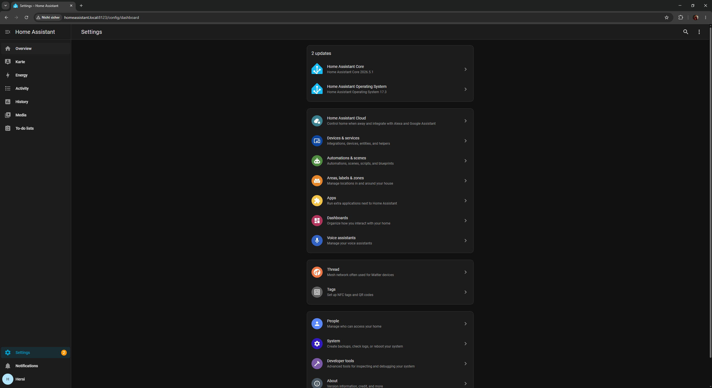
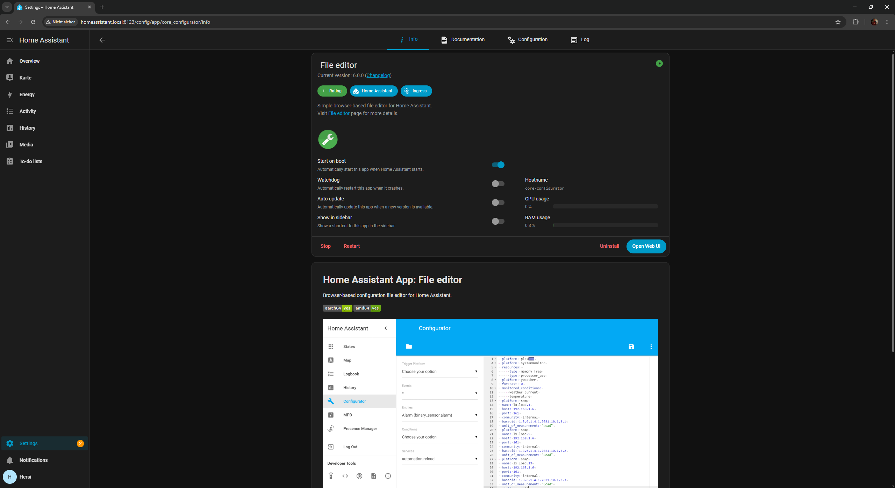
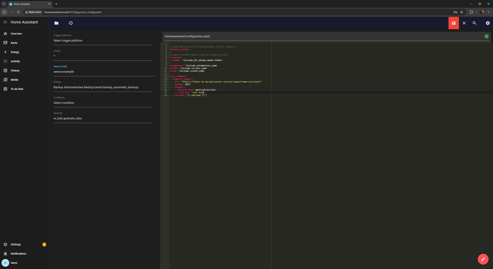
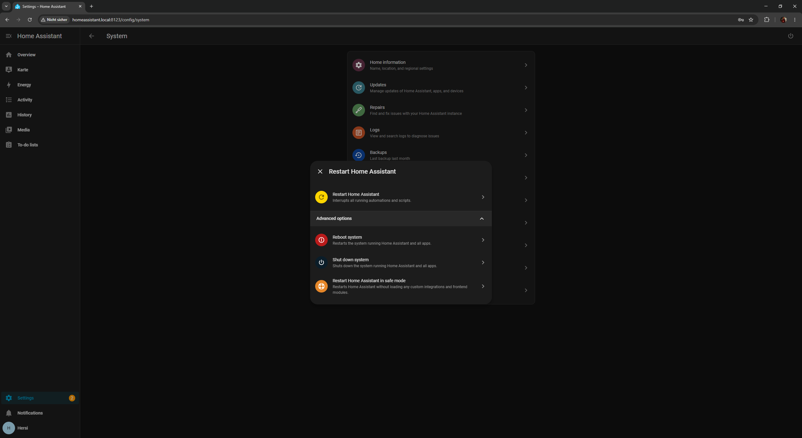
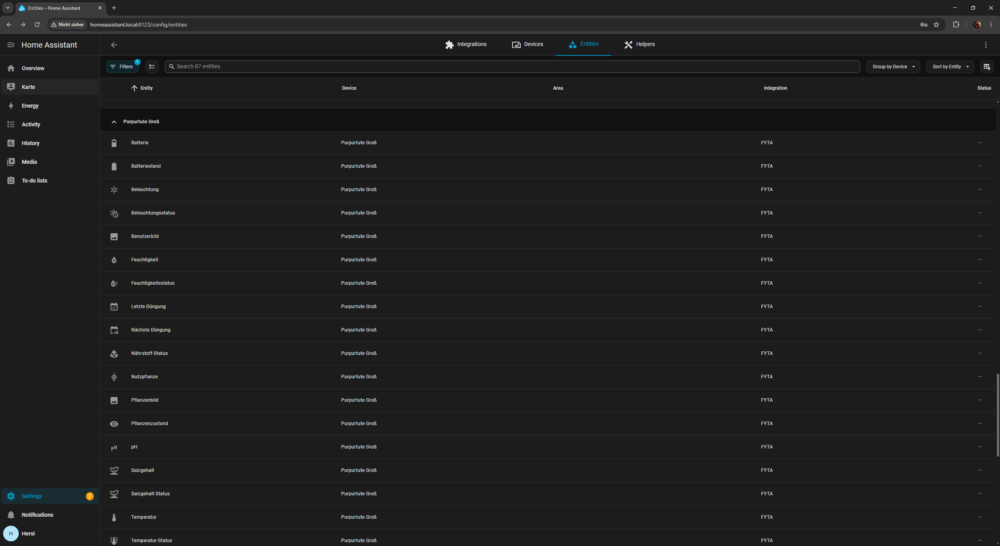
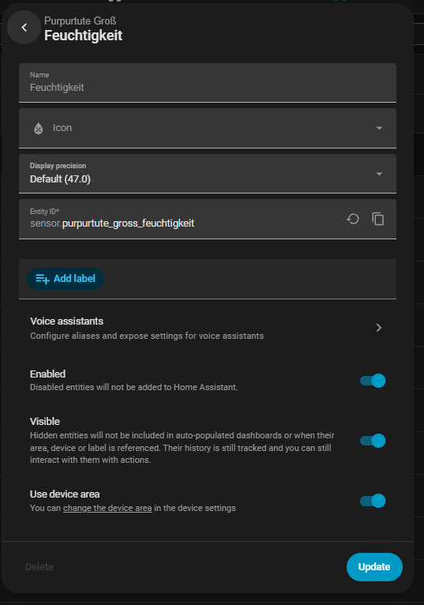
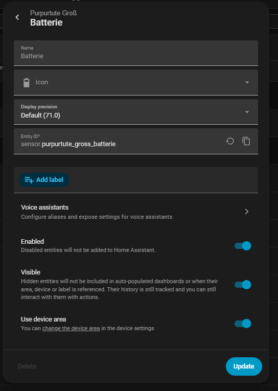
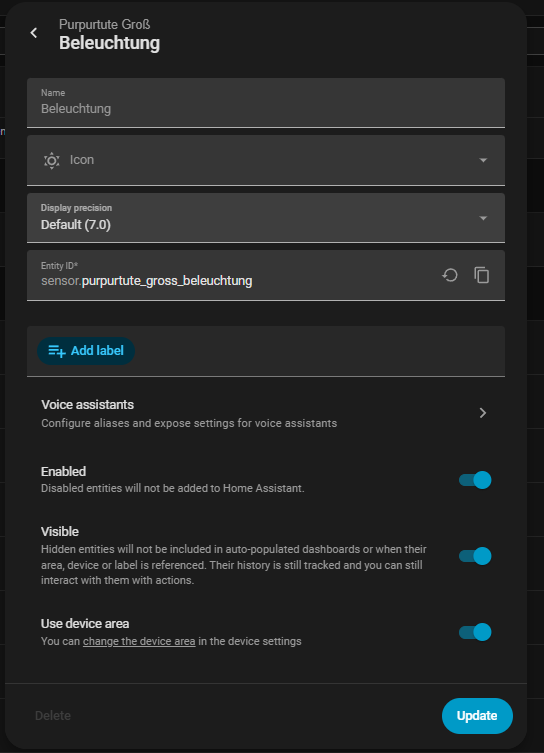
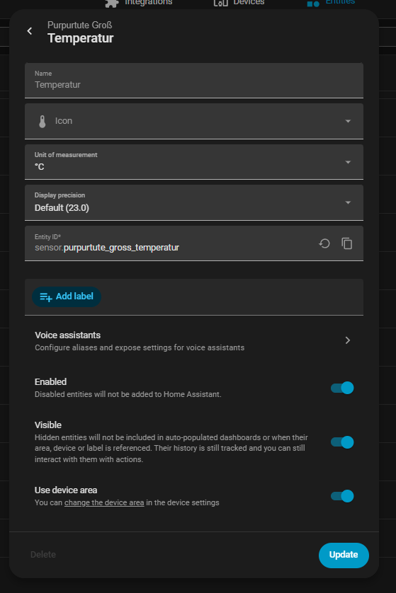
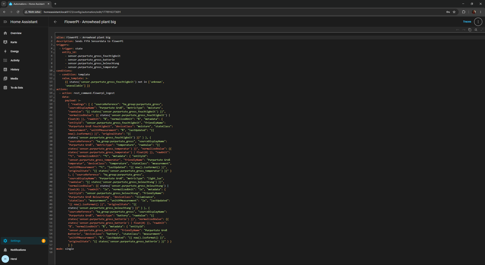

# FlowerPI — Home Assistant Integration Guide

**Tested with:** FYTA sensor · Home Assistant OS 2026.5.1 · FlowerPI 2.0  
**No extra hardware required** — works with any plant sensor already in Home Assistant (FYTA, Xiaomi Mi Flora, Tuya, Zigbee, and more)

---

## What you need

- Home Assistant (HAOS or Supervised)
- At least one plant sensor already integrated into HA
- A FlowerPI account
- ~10 minutes

---

## Step 1 — Install the File Editor add-on

Go to **Settings** in Home Assistant.



> **Note:** In newer HAOS versions, add-ons are listed under **"Apps"** instead of "Add-ons".

Click **Apps → Add-on Store**, search for **"File editor"**, install it, and enable **"Show in sidebar"**.



---

## Step 2 — Generate an API key in FlowerPI

In FlowerPI: **Settings → API → Create new key**

Copy the generated key — you'll need it in the next step.

---

## Step 3 — Add the REST command to configuration.yaml

Open the **File Editor** from the sidebar and navigate to `/config/configuration.yaml`.

Add the following at the end of the file:

```yaml
rest_command:
  flowerpi_ingest:
    url: "https://flower-pi.com/api/sensor-sources/ingest/home-assistant"
    method: POST
    headers:
      Content-Type: application/json
      X-Api-Key: "YOUR-API-KEY"
    payload: "{{ payload }}"
```

Replace `YOUR-API-KEY` with the key from Step 2.

Save the file (💾 icon top right).



---

## Step 4 — Restart Home Assistant

Go to **Settings → System → Restart Home Assistant** (the yellow option — no full reboot needed).



---

## Step 5 — Find your sensor entity IDs

Go to **Settings → Devices & Services → Entities** and search for your plant.

Click each sensor to see its **Entity ID**:



Click each relevant sensor to get the exact entity ID:






Note down all entity IDs, for example:
- `sensor.my_plant_feuchtigkeit`
- `sensor.my_plant_batterie`
- `sensor.my_plant_beleuchtung`
- `sensor.my_plant_temperatur`

---

## Step 6 — Create the automation

Go to **Settings → Automations & Scenes → Create automation**.

Click the **three dots (⋮) → Edit in YAML**, clear everything and paste the following (adjust entity IDs and plant name):

```yaml
alias: FlowerPI - My Plant
description: Sends sensor data to FlowerPI
triggers:
  - trigger: state
    entity_id:
      - sensor.MY_PLANT_feuchtigkeit
      - sensor.MY_PLANT_batterie
      - sensor.MY_PLANT_beleuchtung
      - sensor.MY_PLANT_temperatur
conditions:
  - condition: template
    value_template: >-
      {{ states('sensor.MY_PLANT_feuchtigkeit') not in ['unknown', 'unavailable'] }}
actions:
  - action: rest_command.flowerpi_ingest
    data:
      payload: >-
        { "readings": [ { "sourceReference": "ha_group:MY_PLANT",
        "sourceDisplayName": "My Plant", "metricType": "moisture",
        "rawValue": "{{ states('sensor.MY_PLANT_feuchtigkeit') }}",
        "normalizedValue": {{ states('sensor.MY_PLANT_feuchtigkeit') | float(0) }},
        "rawUnit": "%", "normalizedUnit": "%", "metadata": { "entityId":
        "sensor.MY_PLANT_feuchtigkeit", "friendlyName": "My Plant Moisture",
        "deviceClass": "moisture", "stateClass": "measurement",
        "unitOfMeasurement": "%", "lastUpdated": "{{ now().isoformat() }}",
        "originalState": "{{ states('sensor.MY_PLANT_feuchtigkeit') }}" } },
        { "sourceReference": "ha_group:MY_PLANT", "sourceDisplayName": "My Plant",
        "metricType": "temperature", "rawValue": "{{ states('sensor.MY_PLANT_temperatur') }}",
        "normalizedValue": {{ states('sensor.MY_PLANT_temperatur') | float(0) }},
        "rawUnit": "°C", "normalizedUnit": "°C", "metadata": { "entityId":
        "sensor.MY_PLANT_temperatur", "friendlyName": "My Plant Temperature",
        "deviceClass": "temperature", "stateClass": "measurement",
        "unitOfMeasurement": "°C", "lastUpdated": "{{ now().isoformat() }}",
        "originalState": "{{ states('sensor.MY_PLANT_temperatur') }}" } },
        { "sourceReference": "ha_group:MY_PLANT", "sourceDisplayName": "My Plant",
        "metricType": "light_lux", "rawValue": "{{ states('sensor.MY_PLANT_beleuchtung') }}",
        "normalizedValue": {{ states('sensor.MY_PLANT_beleuchtung') | float(0) }},
        "rawUnit": "lx", "normalizedUnit": "lx", "metadata": { "entityId":
        "sensor.MY_PLANT_beleuchtung", "friendlyName": "My Plant Light",
        "deviceClass": "illuminance", "stateClass": "measurement",
        "unitOfMeasurement": "lx", "lastUpdated": "{{ now().isoformat() }}",
        "originalState": "{{ states('sensor.MY_PLANT_beleuchtung') }}" } },
        { "sourceReference": "ha_group:MY_PLANT", "sourceDisplayName": "My Plant",
        "metricType": "battery", "rawValue": "{{ states('sensor.MY_PLANT_batterie') }}",
        "normalizedValue": {{ states('sensor.MY_PLANT_batterie') | float(0) }},
        "rawUnit": "%", "normalizedUnit": "%", "metadata": { "entityId":
        "sensor.MY_PLANT_batterie", "friendlyName": "My Plant Battery",
        "deviceClass": "battery", "stateClass": "measurement",
        "unitOfMeasurement": "%", "lastUpdated": "{{ now().isoformat() }}",
        "originalState": "{{ states('sensor.MY_PLANT_batterie') }}" } } ] }
mode: single
```

> **Important:** Replace `MY_PLANT` with your actual sensor prefix and `ha_group:MY_PLANT` with a unique ID without spaces (e.g. `ha_group:arrowhead_plant`).



Save the automation.

---

## Step 7 — Test it

Trigger the automation manually: in the automation list, click the three dots → **"Trigger"**.

Then in FlowerPI go to **Settings → Sensor Sources** — `ha_group:MY_PLANT` should appear with a current timestamp.

---

## Step 8 — Link the source to your plant

In FlowerPI, navigate to your plant → **Edit → Advanced Settings → Data source**.

Select `ha_group:MY_PLANT` and map the metrics:
- Moisture → moisture
- Temperature → temperature
- Light → light_lux
- Battery → battery

Save — done. Readings will now appear directly on the plant page.

---

## Adding more plants

For each additional plant:
1. Duplicate the automation
2. Adjust the entity IDs
3. Change `sourceReference` to `ha_group:NEW_PLANT`
4. In FlowerPI, link the new source to the plant

---

## Supported metric types

| metricType | Unit | Description |
|---|---|---|
| `moisture` | % | Soil moisture |
| `temperature` | °C / °F | Temperature |
| `light_lux` | lx | Illuminance |
| `light_ppfd` | µmol/m²/s | Photosynthetically active radiation |
| `conductivity` | µS/cm | Conductivity / nutrients |
| `battery` | % | Battery level |
| `humidity` | % | Air humidity |

---

## Compatible sensors

| Sensor | Integration | Notes |
|---|---|---|
| FYTA Beam | FYTA HA Integration | Tested ✓ |
| Xiaomi Mi Flora | Passive BLE Monitor | moisture, temperature, conductivity, light_lux |
| Tuya plant sensor | Tuya / Local Tuya | Depends on device |
| Zigbee plant sensor | Zigbee2MQTT | Any entity works |
